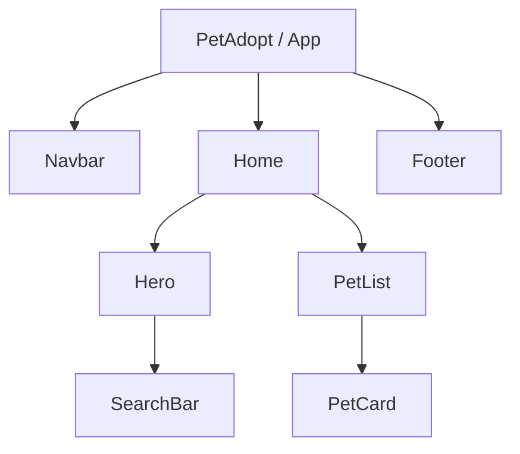

# Diseño inicial del frontend de PetAdopt

## Arquitectura general

PetAdopt mantiene el backend Django y el frontend React separados dentro del mismo repositorio:

- **Backend Django:** permanece en la raíz del repositorio. `manage.py` inicia el proyecto configurado en `config/`, mientras que `core/` y `users/` contienen las aplicaciones existentes.
- **Frontend React:** vive en `frontend/` y usa Vite como servidor de desarrollo y herramienta de construcción. Durante el desarrollo se ejecuta de manera independiente en `http://localhost:3000`.
- **Integración futura:** React podrá consumir la API HTTP expuesta por Django. Este TP solamente prepara la estructura visual inicial; no agrega todavía esa integración.

## Componentes iniciales de la Home

- `App`: composición principal de la aplicación.
- `Navbar`: identidad y navegación principal.
- `Home`: página inicial que agrupa el contenido central.
- `Hero`: mensaje principal de adopción.
- `SearchBar`: bosquejo visual del buscador.
- `PetList`: grilla inicial de mascotas destacadas.
- `PetCard`: presentación resumida de una mascota.
- `Footer`: cierre y datos generales del sitio.

## Diagrama de componentes

La estructura está pensada como punto de partida y puede ampliarse en próximos trabajos prácticos con rutas, conexión a la API y estado de la aplicación.
